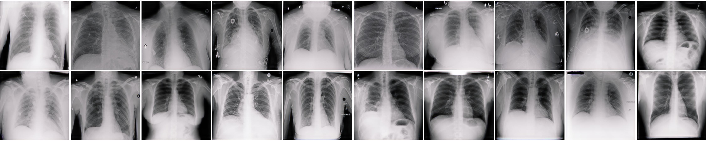
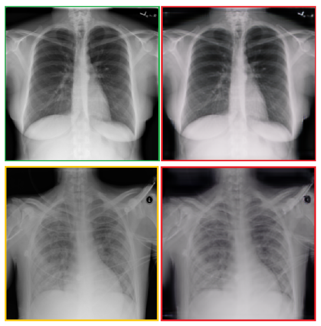
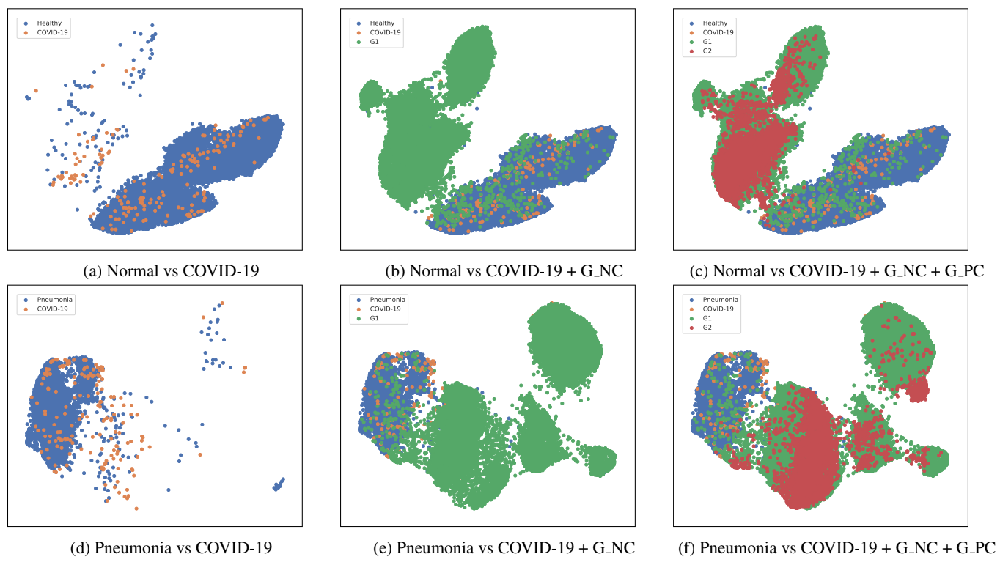

## Synthetic Image Dataset of COVID-19 Chest X-rays 

    

A public dataset for synthetic COVID-19 chest X-ray cases. Data is available [here](https://github.com/hasibzunair/synthetic-covid-cxr-dataset/releases).

**More details coming soon. A manuscript describing the data generatation procedure with the validation study has been submitted for possible publication.**

## Data Generation Pipeline

Contains 21,295 synthetic COVID-19 chest X-ray images. Original data from [RSNA Kaggle Dataset](https://academictorrents.com/details/95588a735c9ae4d123f3ca408e56570409bcf2a9) and [COVID-19 Image Data Collection](https://github.com/ieee8023/covid-chestxray-dataset) which are publicly avaiable and can be downloaded from the URLs.

    
  <em> 
    Figure 1. Given any two unordered image collections, the generative algorithm learns to automatically translate an image from one category to another. Top: Normal (left) to COVID-19 (right). Bottom: Pneumonia (left) to COVID-19 (right). Subtle visual changes can be observed in the translated images due
to low inter-class variation.
    </em>

## Preliminary results

    
  <em> 
    Figure 2. Two-dimensional UMAP of features to determine the distribution of original and synthetic examples. Both both tasks it
can be seen that the synthetic samples are in a different distribution in the feature space which enables a decision boundary among
the classes.
    </em>

## Citation

Will be added soon.

## Acknowledgements

Will be added soon.

