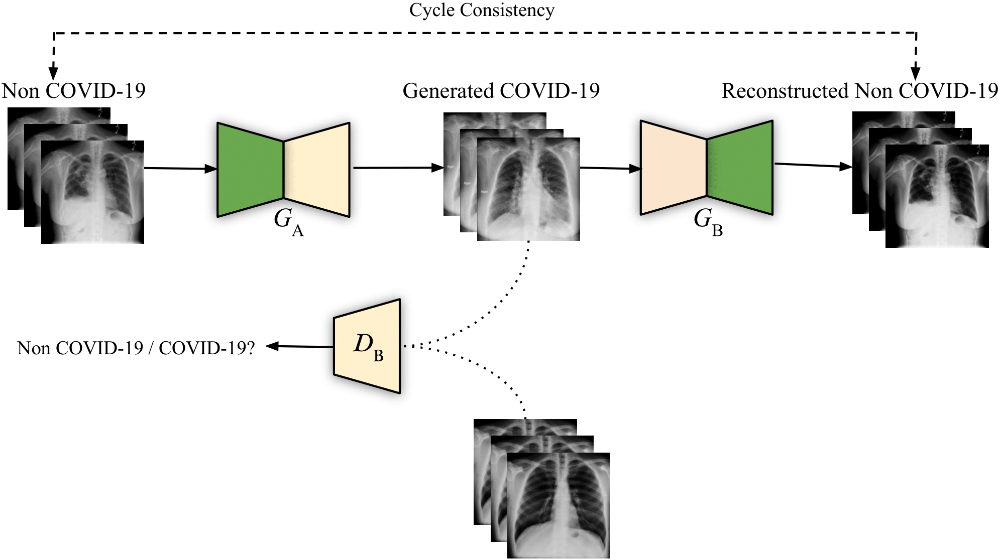
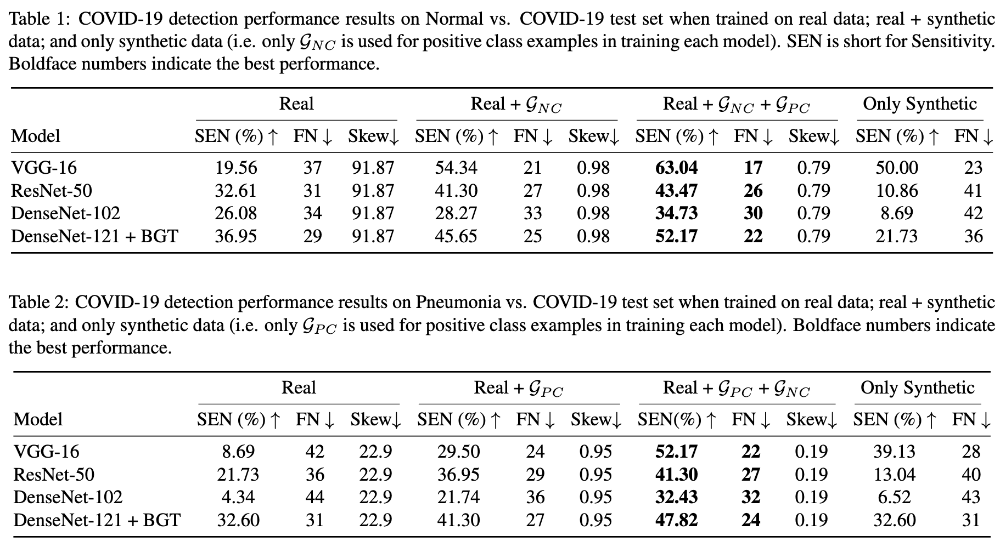

# Synthetic COVID-19 Chest X-ray Dataset for Computer-Aided Diagnosis

This repository is part of the supplementary materials for our ICML 2021 Workshop on Computational Biology (WCB) paper. A more detailed version titled *Synthesis of COVID-19 Chest X-rays using Unpaired Image-to-Image Translation* is published in the Journal of Social Network Analysis and Mining (SNAM).

The dataset consists of 21,295 synthetic COVID-19 chest X-ray images generated using [this](https://github.com/hasibzunair/adversarial-lesions) algorithm. Dataset is available at this [link](https://github.com/hasibzunair/synthetic-covid-cxr-dataset/releases/tag/v0.1).

<p align="center">
  <a href="#"></a> <br />
  <em> 
    Figure 1. Illustration of the data generation process based on unpaired image-to-image translation. Chest X-ray images are translated from Non-COVID-19 (i.e. Normal or Pneumonia) to COVID-19 and then back to Non-COVID-19 via cycle-consistency
    </em>
</p>


## Resources
* ICML 2021 WCB Paper (Will be added)
* [SNAM Journal Paper](https://link.springer.com/article/10.1007/s13278-021-00731-5)

## Result highlights

<p align="center">
  <a href="#"></a> <br />
</p>

## Citation
If you use this dataset in your scientific work, please cite the following:
```bibtex
@article{zunair2021synthesis,
  title={Synthesis of {COVID}-19 chest {X}-rays using unpaired image-to-image translation},
  author={Zunair, Hasib and Hamza, A Ben},
  journal={Social Network Analysis and Mining},
  volume={11},
  number={1},
  pages={1--12},
  year={2021},
  publisher={Springer}
}

@article{zunair2020melanoma,
  title={Melanoma detection using adversarial training and deep transfer learning},
  author={Zunair, Hasib and Hamza, A Ben},
  journal={Physics in Medicine \& Biology},
  year={2020},
  publisher={IOP Publishing}
}
```


